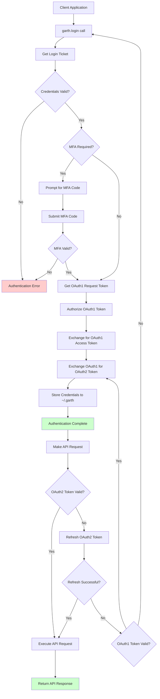
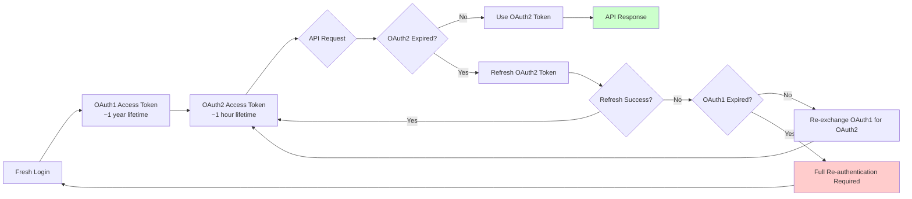

# Garth - Garmin SSO Authentication Flows Documentation

## Overview

Garth is a Python library that provides authenticated access to Garmin Connect APIs using the same authentication flow as the official Garmin Connect mobile application. It implements a sophisticated OAuth1/OAuth2 hybrid authentication system that maintains long-term session persistence.

## Architecture Summary

- **Primary Domain**: `connect.garmin.com` (or `connect.garmin.cn` for China)
- **Authentication Method**: Hybrid OAuth1 + OAuth2 with SSO
- **Session Persistence**: OAuth1 tokens valid for ~1 year
- **MFA Support**: Built-in multi-factor authentication handling
- **Storage**: Local credential caching in `~/.garth` by default

## Authentication Flow Components

### 1. Initial Login Flow

#### 1.1 Credential Validation
```
Endpoint: https://sso.garmin.com/sso/signin
Method: POST
Headers:
  - Content-Type: application/x-www-form-urlencoded
  - User-Agent: GCMv3 (Garmin Connect Mobile v3)

Parameters:
  - username: <email_address>
  - password: <password>
  - embed: true
  - lt: <login_ticket> (obtained from initial GET request)
  - _eventId: submit
  - displayNameRequired: false
```

#### 1.2 Login Ticket Acquisition
```
Endpoint: https://sso.garmin.com/sso/signin
Method: GET
Headers:
  - User-Agent: GCMv3

Purpose: Extract login ticket (lt) from hidden form field
Response: HTML form with embedded lt parameter
```

### 2. Multi-Factor Authentication (MFA)

#### 2.1 MFA Detection
After initial credential validation, if MFA is required:

```
Response Pattern:
- HTTP 200 with MFA challenge form
- Contains: mfaCode input field
- Action endpoint: https://sso.garmin.com/sso/verifyMFA
```

#### 2.2 MFA Code Submission
```
Endpoint: https://sso.garmin.com/sso/verifyMFA
Method: POST
Headers:
  - Content-Type: application/x-www-form-urlencoded

Parameters:
  - mfaCode: <6_digit_code>
  - lt: <login_ticket>
  - _eventId: submit
```

### 3. OAuth Token Exchange Flow

#### 3.1 OAuth1 Consumer Credentials
```python
OAUTH_CONSUMER = {
    'key': 'fc020df2-e33d-4ec5-987a-7fb6de2e3850',
    'secret': 'secret_key_from_mobile_app'  # Embedded in mobile app
}
```

#### 3.2 OAuth1 Request Token
```
Endpoint: https://connectapi.garmin.com/oauth-service/oauth/request_token
Method: GET
Headers:
  - Authorization: OAuth oauth_consumer_key="...", oauth_nonce="...", 
                  oauth_signature_method="HMAC-SHA1", oauth_timestamp="...",
                  oauth_version="1.0", oauth_signature="..."

Response:
  oauth_token=<request_token>&oauth_token_secret=<request_secret>
```

#### 3.3 OAuth1 Authorization
```
Endpoint: https://connect.garmin.com/oauthConfirm
Method: GET
Parameters:
  - oauth_token: <request_token>
  - oauth_callback: https://connect.garmin.com/modern/

Headers:
  - Cookie: <session_cookies_from_login>
```

#### 3.4 OAuth1 Access Token Exchange
```
Endpoint: https://connectapi.garmin.com/oauth-service/oauth/access_token
Method: POST
Headers:
  - Authorization: OAuth oauth_consumer_key="...", oauth_nonce="...",
                  oauth_signature_method="HMAC-SHA1", oauth_timestamp="...",
                  oauth_token="<request_token>", oauth_verifier="<oauth_verifier>",
                  oauth_version="1.0", oauth_signature="..."

Response:
  oauth_token=<access_token>&oauth_token_secret=<access_secret>
```

### 4. OAuth2 Token Exchange

#### 4.1 OAuth2 Authorization Request
```
Endpoint: https://connectapi.garmin.com/oauth-service/oauth/exchange_token
Method: POST
Headers:
  - Authorization: OAuth oauth_consumer_key="...", oauth_nonce="...",
                  oauth_signature_method="HMAC-SHA1", oauth_timestamp="...",
                  oauth_token="<oauth1_access_token>", oauth_version="1.0",
                  oauth_signature="..."

Response Format (JSON):
{
  "access_token": "<oauth2_access_token>",
  "token_type": "Bearer",
  "expires_in": 3600,
  "refresh_token": "<oauth2_refresh_token>",
  "scope": "GHS_ADMIN_READ GHS_ADMIN_WRITE"
}
```

### 5. Token Refresh Flow

#### 5.1 OAuth2 Token Refresh
```
Endpoint: https://connectapi.garmin.com/oauth-service/oauth/token
Method: POST
Headers:
  - Content-Type: application/x-www-form-urlencoded

Parameters:
  - grant_type: refresh_token
  - refresh_token: <oauth2_refresh_token>

Response:
{
  "access_token": "<new_oauth2_access_token>",
  "token_type": "Bearer", 
  "expires_in": 3600,
  "refresh_token": "<new_oauth2_refresh_token>",
  "scope": "GHS_ADMIN_READ GHS_ADMIN_WRITE"
}
```

## Session Management

### 6. Credential Storage Structure

#### 6.1 Storage File Location
```
Default Path: ~/.garth
Format: JSON
Permissions: 600 (user read/write only)
```

#### 6.2 Stored Credential Format
```json
{
  "domain": "garmin.com",
  "oauth1_token": {
    "oauth_token": "<oauth1_access_token>",
    "oauth_token_secret": "<oauth1_access_secret>"
  },
  "oauth2_token": {
    "access_token": "<oauth2_access_token>",
    "token_type": "Bearer",
    "expires_in": 3600,
    "expires_at": 1698765432,
    "refresh_token": "<oauth2_refresh_token>",
    "scope": "GHS_ADMIN_READ GHS_ADMIN_WRITE"
  },
  "user_profile": {
    "username": "<username>",
    "profile_id": "<profile_id>",
    "display_name": "<display_name>"
  }
}
```

### 7. API Request Authentication

#### 7.1 Connect API Requests
```
Base URL: https://connectapi.garmin.com
Headers:
  - Authorization: Bearer <oauth2_access_token>
  - NK: NT  (Garmin-specific header)
  - User-Agent: GCMv3

Auto-refresh: OAuth2 token refreshed automatically when expired
```

#### 7.2 Upload API Requests
```
Endpoint: https://connectapi.garmin.com/upload-service/upload
Method: POST
Headers:
  - Authorization: OAuth oauth_consumer_key="...", oauth_nonce="...",
                  oauth_signature_method="HMAC-SHA1", oauth_timestamp="...",
                  oauth_token="<oauth1_access_token>", oauth_version="1.0",
                  oauth_signature="..."
  - Content-Type: multipart/form-data

Body: Multipart form with FIT file data
```

## Key Endpoints Reference

### 8. Authentication Endpoints

| Purpose | Method | Endpoint |
|---------|--------|----------|
| Get Login Form | GET | `https://sso.garmin.com/sso/signin` |
| Submit Credentials | POST | `https://sso.garmin.com/sso/signin` |
| Verify MFA | POST | `https://sso.garmin.com/sso/verifyMFA` |
| OAuth Request Token | GET | `https://connectapi.garmin.com/oauth-service/oauth/request_token` |
| OAuth Authorize | GET | `https://connect.garmin.com/oauthConfirm` |
| OAuth Access Token | POST | `https://connectapi.garmin.com/oauth-service/oauth/access_token` |
| OAuth2 Exchange | POST | `https://connectapi.garmin.com/oauth-service/oauth/exchange_token` |
| OAuth2 Refresh | POST | `https://connectapi.garmin.com/oauth-service/oauth/token` |

### 9. Data API Endpoints

| Data Type | Method | Endpoint Pattern |
|-----------|--------|------------------|
| Sleep Data | GET | `/wellness-service/wellness/dailySleepData/{username}` |
| Stress Data | GET | `/usersummary-service/stats/stress/weekly/{date}/{weeks}` |
| User Profile | GET | `/userprofile-service/userprofile` |
| Activities | GET | `/activitylist-service/activities/search/activities` |
| Upload FIT | POST | `/upload-service/upload` |
| Weight Data | GET | `/weight-service/weight/daterangesnapshot` |

## Configuration Options

### 10. Domain Configuration

#### 10.1 Global Domains
- **Standard**: `garmin.com` (default)
- **China**: `garmin.cn` (use `garth.configure(domain="garmin.cn")`)

#### 10.2 Proxy Configuration
```python
garth.configure(
    proxies={"https": "http://localhost:8888"}, 
    ssl_verify=False
)
```

## Error Handling

### 11. Common Error Scenarios

#### 11.1 Session Expiration
```python
from garth.exc import GarthException

try:
    garth.client.username
except GarthException:
    # Session expired - need to re-authenticate
    garth.login(email, password)
```

#### 11.2 MFA Required
```python
# Synchronous MFA handling
result1, result2 = garth.login(email, password, return_on_mfa=True)
if result1 == "needs_mfa":
    mfa_code = input("Enter MFA code: ")
    oauth1, oauth2 = garth.resume_login(result2, mfa_code)
```

#### 11.3 Token Refresh Failures
- Automatic retry mechanism built-in
- Falls back to OAuth1 if OAuth2 refresh fails
- Full re-authentication required if OAuth1 tokens expire

## Security Considerations

### 12. Security Features

#### 12.1 Token Security
- OAuth1 tokens have 1-year lifetime
- OAuth2 tokens expire every hour (auto-refreshed)
- Stored credentials encrypted at filesystem level
- No plaintext password storage

#### 12.2 Session Security
- CSRF protection via login tickets
- MFA support for enhanced security  
- Secure random nonce generation for OAuth signatures
- HMAC-SHA1 signature validation

#### 12.3 Network Security
- All communications over HTTPS
- Certificate validation enabled by default
- User-Agent matching official mobile app
- Request rate limiting handled automatically

## Flow Diagrams

### 13. End-to-End Authentication Flow



### 14. Token Lifecycle Management



## Implementation Notes

### 15. Key Implementation Details

#### 15.1 User Agent String
- Uses `GCMv3` to mimic Garmin Connect Mobile v3
- Critical for endpoint compatibility
- Some endpoints reject requests without proper User-Agent

#### 15.2 OAuth Signature Generation  
- HMAC-SHA1 signatures for OAuth1 requests
- Includes all OAuth parameters in signature base string
- Consumer secret and token secret used as signing key

#### 15.3 Session Cookie Handling
- Automatic cookie jar management
- Session cookies preserved across authentication flow
- Required for OAuth authorization step

#### 15.4 Rate Limiting
- Built-in request throttling
- Exponential backoff for failed requests
- Respects Garmin's API rate limits

This comprehensive documentation covers all aspects of the Garth authentication system, from initial login through ongoing API access, providing developers with the technical details needed to understand and work with the authentication flows.
